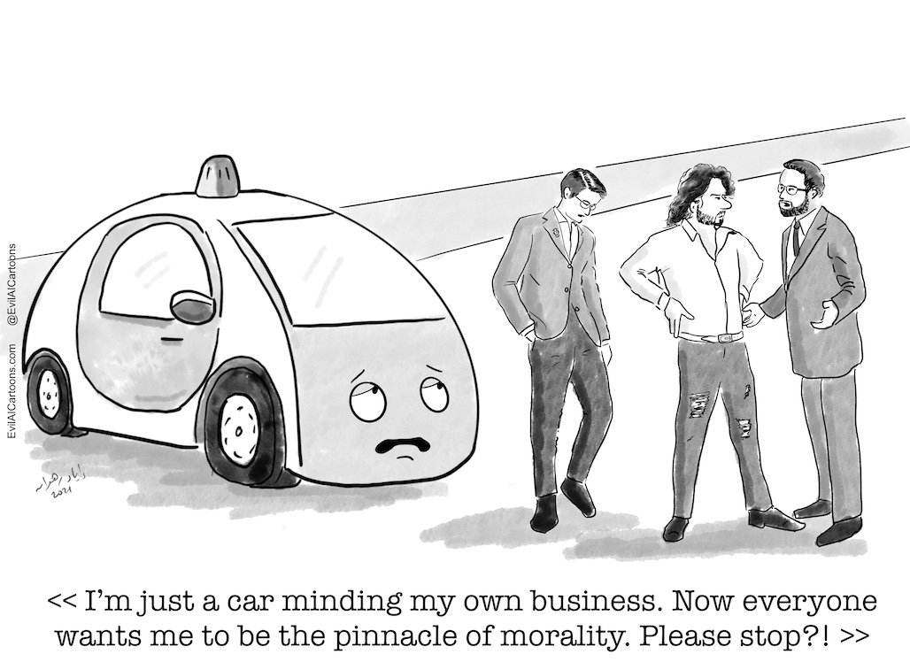

AI ethics is an enormous topic, at least as large as AI itself. You could take an entire university level course on the subject (here at the University of Florida, no less). In the time we have allotted for this content, we will barely scratch the surface of the topic. Still, it is vitally important that when working with AI tools that you keep ethics at the forefront of your mind. At some level, all AI tools represent offloading human decision-making to a machine, which then in-turn affects other humans

Evil AI Cartoon. Credit - [EvilAICartoons.com](https://www.evilaicartoons.com/archive/use-all-tools-of-regulation)

### The Rome Call for AI Ethics

[The Rome Call for AI Ethics](https://www.romecall.org/the-call/) is a document that was signed by a group of organizations in February 2020. The signatories include the Pontifical Academy for Life, Microsoft, IBM, FAO, the Italian Ministry of Innovation, and several universities (including the University of Florida).

> "[The University of Florida] is committed to an ethical and equitable approach to AI in its teaching, research and business practices. The university requires an ethics course (Ethics, Data, and Technology) in all certificates and majors related to AI and data science. In addition, UF is part of a global agreement with seven other worldwide universities and major industrial leaders committed to the development of [human-centered approaches to AI](https://news.ufl.edu/2022/11/rome-ethics/). The university signed a commitment to the [Rome Call for AI Ethics](https://www.romecall.org/), joining a network of universities that will share best practices, tools, and educational content, as well as meet regularly to share updates and discuss innovative ideas. The Rome Call for AI Ethic’s principles ask for transparency, inclusion, responsibility, impartiality, reliability and security in building AI systems, research, education and workforce development.” – From the University of Florida’s AI University Initiative. ([Source](https://ai.ufl.edu/about/ai-ethics/))

As mentioned above, the Rome Call for AI Ethics outlines six principles for the ethical development and use of AI. These principles are:

1. **Transparency:** AI systems must be understandable to all.
1. **Inclusion:** AI systems must not discriminate against anyone because every human being has equal dignity.
1. **Responsibility:** There must always be someone who takes responsibility for what a machine does.
1. **Impartiality:** AI systems must not follow or create biases.
1. **Reliability:** AI must be reliable.
1. **Security and privacy:** These systems must be secure and respect the privacy of users.

The Rome Call for AI Ethics is a significant document because it is one of the first high-level calls for an ethical approach to AI. The signatories to the call represent a wide range of stakeholders, including religious organizations, technology companies, and governments. This broad support for the call is a sign that there is a growing consensus that AI needs to be developed and used in an ethical way.
It is intended to be a living document. The signatories have committed to updating it regularly to reflect the changing landscape of AI and met as recently as January 2023. This ensures that the call remains relevant as AI continues to develop.

The Rome Call for AI Ethics is a valuable resource for anyone who is interested in the ethical development and use of AI. The call provides a clear and concise overview of key ethical issues related to the subject. It also outlines a set of principles that can be used to guide the development and use of AI in a way that is beneficial to humanity.

We should also point out a key criticism for this framework: Its vague. Very vague. The Rome Call for AI Ethics gives us a list of things to consider but lacks firm guidance on implementation. How you go about following these principles will require decisions made at every level of the AI application development process.

For each principle listed above, consider the following:

1. Imagine you are a Supervillain. What would you do to take advantage of AI, or how would you use AI to do evil if this principle were not in place? Feel free to be creative!
1. Now imagine you are just a terribly busy, very tired software developer and you have a deadline looming. What would some potential consequences be if you rolled out an AI-enabled project without applying this principle?
1. What are some safeguards you can think of to ensure that this principle is implemented?

### AI as Moral Agents

To make the issue a little more concrete, consider the case of driverless cars. Driverless cars have already been executing decisions with ethical implications for years now, and disagreements over their moral frameworks are part of why the technology has stalled in its development.

1. Watch the TED-Ed video "[The Ethical Dilemma of Self-Driving Cars](https://youtu.be/ixIoDYVfKA0)" by Patrick Lin

1. Recalling the principles listed in the Rome Call for AI Ethics, consider each of the following:
   1. Transparency
      * How can we make the decision-making process of a self-driving car understandable to the passengers and other road users?
      * Should there be a way for users to see the process the AI uses to make decisions in real-time? How could this be implemented?
   1. Inclusion
      * How can we ensure that AI systems in self-driving cars do not discriminate against individuals based on their age, race, gender, disability, or any other factor?
      * How can we make sure the development teams for these AI systems are avoiding unconscious biases?
   1. Responsibility
      * Who should be held responsible when a self-driving car makes a mistake that leads to an accident? The developer of the AI system? The owner of the vehicle?
      * How do you think laws should be adjusted to accommodate the increased usage of AI in areas of responsibility and liability?
   1. Impartiality
      * How can we ensure that the algorithms used in self-driving cars do not inadvertently favor certain groups of people or locations?
      * What safeguards can be put in place to prevent AI systems from adopting biases present in their training data?
   1. Reliability
      * What measures should be taken to ensure that AI systems in autonomous vehicles are reliable and safe?
      *	What would be considered an acceptable error rate for self-driving cars?
   1. Security and Privacy
      * How can we protect the AI systems in self-driving cars from malicious attacks?
      * How can we ensure the privacy of the passengers, considering that these cars might need to process personal data (e.g., regular routes, driving habits)?
      * As self-driving cars may gather large amounts of data about their environment, how do we ensure this doesn't infringe on the privacy of individuals or property captured in that data?

### Conclusion

As stated previously, this short lesson is only meant to prime you on the topic of AI ethics. While working with AI applications in a professional environment you should become familiar with your employer's policies (or lack thereof) on AI ethics. If you are the employer or are working alone then you should take the time to review your practices to ensure you're taking a methodical approach to implementing AI ethics into your work.

### Optional Activity: A Crash Course in AI Ethics

Let’s look at MIT’s Moral Machine. The Moral Machine is part survey, part tool designed to help guide and educate people on AI decision-making.

[Click to visit the Moral Machine site.](https://www.moralmachine.net/)

* **Watch** the video on the main page, "Moral Machine - Human Perspectives on Machine Ethics".
* **Click the red button labeled "Start Judging".**

  * An exercise will launch that will have you select the actions of a self-driving car in a variety of scenarios. 
  * **Be sure to use the “Show Description” button to see the details for each scenario.**
  * Make your selections until you get to the Results screen. Review the Results screen and consider the following questions:
      1. How did your answers compare to “Others”? Do you agree with the current consensus?
      1. Do you think that this crowdsourced method is the right way to make these ethical decisions? If not, how should they be made (panel of ethicists, the discretion of programmers, elected officials, etc.)?
      1. How do you feel about offloading potentially lethal decision-making to machines? While these scenarios seem contrived and there are likely alternatives to avoid killing anyone, at some level, AI controlled systems are already making decisions now that may result in harms to some people and benefits to others. Who programs those systems and how they are programmed to act is already relevant to the discussions around AI.
      1. What other ethical considerations should be taken into account when thinking about the behavior of self-driving cars?

***

[Back to course home](/getting_started/README)