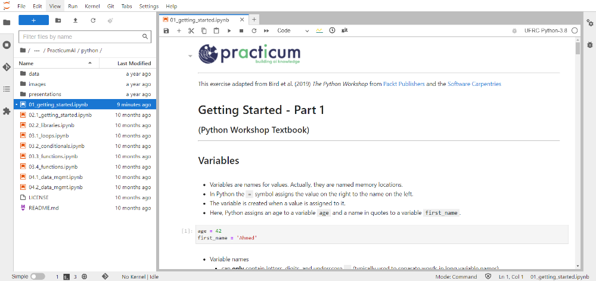

## Getting started with Jupyter on HiPerGator

> **Note:These instructions assume that you already have an account on HiPerGator.

### 1. Connect to [https://ood.rc.ufl.edu](https://ood.rc.ufl.edu/pun/sys/dashboard)

1. Open a browser and go to: [https://ood.rc.ufl.edu](https://ood.rc.ufl.edu/pun/sys/dashboard)
(Probably good to bookmark this site as we'll use it a lot)
1. Select your institution and login.

### 1b. First time only: Link to your /blue directory

> The first time you use Jupyter on HiPerGator, we need to make a link from your `/home` directory to the `/blue` directory for your group. Once setup, this will remain and there is no need to re-do this step.

1. From the **Clusters** menu, select **"_Hipergator Shell Access"**
1. At the Unix prompt, please type the following commands and hit enter after each one.
   > One convention we will use is to put values that need to be changed by the user within angled brackets ("<>"). Do not include the brackets with the replacement text. e.g. `mkdir <Username>` becomes `mkdir albert` for the user with the Username "albert".

   1. Fist, we need to know what group you are in. To determine this, type: `id`
       - The output should look something like:

       ```bash
       [albert@login6 ~]$ id
       uid=10801(albert) gid=1234(rc-workshops) groups=1234(rc-workshops)
       [albert@login6 ~]$
       ```

       - In the above example, user "albert" is in the "rc-workshops" group. In the next step, we would use "rc-workshops" for the group.
   1. Create a symbolic link to the `/blue/<group>` directory, type:

        `ln -s /blue/<group> <LinkName>`

       - For the <group>, substitute your group name
       - For `<LinkName>`, we recommend using `blue_<group>`
       - For example, for the group `rc-workshops` the command would look like: `ln -s /blue/rc-workshops blue_rc-workshops`

1. That's it! You can close the tab.

## 2. JupyterLab Launch Instructions

1. Open a browser and go to: [https://ood.rc.ufl.edu](https://ood.rc.ufl.edu/pun/sys/dashboard)
(Probably good to bookmark this site as we'll use it a lot)

1. From the Interactive Apps menu, select "Jupyter Notebook"--the last item in the list.

1. Enter the values below in the indicated fields on the form, other values can generally be left alone:
   1. Ensure that the JupyterLab checkbox is checked – otherwise, an older, less feature rich environment is run
   
   1. **Maximum memory requested for this job in Gigabytes:** 5
      > Note: Larger dataset may need more memory.
   1. **SLURM Account:** rc-workshops (or your group)
   1. **QoS:** rc-workshops (or your group)
   1. **Cluster partition:** gpu
   1. **Generic Resource Request:** gpu:a100:1
1. After filling out the form, click the launch button near the bottom of the page.

   > Clicking Launch submits the job to the SLURM Scheduler, requesting the resources you have asked for. The scheduler will now look for a place to run your job, or sometimes gives an error message. A common error is asking for too many resources (more than your group has access to).
1. While your job is in the queue, you will see the message "Please be patient as your job currently sits in queue. The wait time depends on the number of cores as well as time requested."  Once it is Running, click **Connect to Jupyter**


1. JupyterLab will then launch in a new tab

## Quick Introduction to Jupyter on HiPerGator

When you open JupyterLab on HiPerGator, the screen should look similar to that shown below.


- On the far left, there are buttons to control the view in the left-hand panel.
- The Files button starts selects.
- Below that are the Kernels and git buttons.
  - The git button will be used to clone and work with `git` repositories.
- The left-hand panel will start with a view of the files and folders in your `/home` directory (`/home/<user>`).
- Assuming you made the link as directed above, there should be a folder that links to `/blue/<group>` with the `blue_group` name.
- The main panel shows the various kernel cards to launch a notebook with a particular kernel. The *Practicum AI* notebooks will automatically select the correct kernel on HiPerGator. A kernel can be thought of as an environment with a particular version of Python and particular modules installed.

In this screenshot, the Python course notebook 01_getting_started.ipynb is open. Notebooks end in the `.ipynb` extension (The predecessor tu Jupyter was iPython, hence the extension).



Notebooks have three types of cells, or blocks: Code, Markdown, and Raw. The top bar will show the type of the selected block and allow you to change the type.

- **Code cells**: are used to type code to run. You can run the code with the play button in the top bar, or using the Shift and Enter keys (Shift-Enter).
- **Markdown cells**: use Markdown syntax to present formatted text. The images, headers, and explanations are made using Markdown and rendered with the same Shift-Enter keys. If you double click on a Markdown cell, you will see the text used to format the text. Hit Shift-Enter to render it again.
- **Raw cells**: are not used very often. They contain raw text that cannot be run as code, and is not formatted as markdown.

